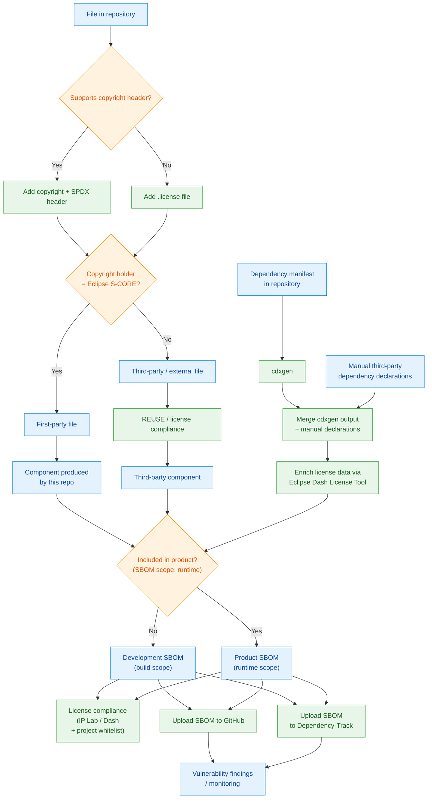

# 6 Compliance & Dependency Analysis ⚪

*Infrastructure for turning repository files, dependency declarations, and build outputs into licensing evidence, SBOMs, and ongoing vulnerability and compliance monitoring across S-CORE.*

⚠️ This chapter is written by ChatGPT and was not yet reviewed

**S-CORE**

This chapter is the canonical home for the end-to-end compliance view: how files in a repository, dependency manifests, and manual declarations become classified components, enriched dependency data, scoped SBOMs, and later monitoring results. [Chapter 3](03-build-infrastructure.md) still owns how inventories, SBOMs, and other evidence are produced during normal builds. This chapter owns what happens once that raw information needs to be interpreted, enriched, scoped, checked for license and vulnerability concerns, and made useful over time.

That scope applies not only to product artifacts, but also to self-developed tooling and environment artifacts such as devcontainer images when S-CORE builds and distributes them. Publication and consumer delivery of those artifacts remain the responsibility of [chapter 8](08-artifact-distribution.md), while CI orchestration of the checks described here belongs in [chapter 7](07-automation-integration.md). **Biggest gap**: the pieces of this compliance flow already exist, but they are not yet described and operated as one shared cross-repository capability spanning file-level licensing, dependency enrichment, SBOM scoping, and continuous monitoring.

## 6.1 End-to-End Compliance Flow ⚪

*System view of how repository content becomes compliance evidence and monitoring inputs.*

**S-CORE**

The easiest way to understand this chapter is to follow the data from repository state to compliance outcomes. Files in the repository need licensing metadata. Dependency manifests need scanning and occasional manual declarations. Those inputs are then merged, enriched, and turned into SBOMs whose scope depends on whether the resulting component is merely part of the development environment or part of the runtime product. The resulting SBOMs can then feed both license-compliance review and continuous vulnerability monitoring.

The exact toolchain may evolve, but the structure of the flow should remain stable:

### 6.1.1 File-Level Classification

*Classifying repository files as first-party or third-party and attaching the licensing metadata they need.*

**S-CORE**

The compliance story begins with ordinary files in a repository. Some files can carry a copyright notice and SPDX identifier directly in the file header. Others need a sidecar `.license` file instead. That is not just formatting detail: it is what allows the project to distinguish first-party material produced by S-CORE from third-party material that has been imported or reused. Third-party files then need to stay visible to REUSE and later license-compliance handling rather than being treated like ordinary project sources. **Biggest gap**: file-level licensing metadata and first-party versus third-party classification are not yet enforced consistently across S-CORE repositories.

### 6.1.2 Dependency Discovery & Enrichment

*Collecting dependency information from manifests, scanners, and manual declarations, then enriching it for later compliance use.*

**S-CORE**

Dependency discovery starts from the manifests a repository already maintains, but that is rarely enough on its own. Scanner output such as `cdxgen` still needs to be merged with manual third-party declarations so the later compliance model reflects reality rather than only what one tool can infer automatically. Once the inputs are combined, license data can be enriched through services such as the Eclipse Dash License Tool. This is the point where raw dependency state turns into something that later SBOM and compliance tooling can work with reliably. **Biggest gap**: generated dependency data and manual declarations are not yet merged and enriched through one consistent cross-repository flow.

### 6.1.3 SBOM Scope Decisions

*Deciding whether the resulting evidence belongs to development-time scope or runtime product scope.*

**S-CORE**

The same repository can produce more than one compliance view. Some components and dependencies belong only to the build or development environment, while others are actually part of the runtime product delivered downstream. That distinction matters because it changes which SBOM should be produced, how findings are interpreted, and which later consumers care about the result. The useful mental model is therefore not "one repository, one SBOM" but "one set of inputs, then a scope decision." **Biggest gap**: S-CORE does not yet have a shared explanation of which inputs belong in development-scope SBOMs, which belong in product SBOMs, and how that decision should be represented consistently.

## 6.2 Repository Inputs & Compliance Evidence ⚪

*The repository-level sources of truth that feed licensing and dependency compliance infrastructure.*

**S-CORE**

Once the end-to-end view is clear, the next question is what the infrastructure actually consumes from repositories. The answer is broader than just dependency files. Compliance also depends on file-level licensing markers, third-party declarations, and a clear view of whether a repository is describing product code, tooling, or environment artifacts. This section therefore focuses on the inputs that need to exist before later SBOM and monitoring steps can work well. **Biggest gap**: repositories do not yet expose one clear, consistent compliance input surface that shared tooling can consume without repository-specific interpretation.

### 6.2.1 Source Files, Headers, and REUSE Metadata

*Using headers, sidecar files, and REUSE-compatible metadata to describe the licensing status of repository content.*

**S-CORE**

Headers and `.license` sidecars are the smallest compliance building blocks, but they are also some of the most important because they preserve intent at the point where content is created or imported. REUSE-style validation depends on that metadata being present and accurate, especially for third-party material that should remain visible as externally sourced content. When this metadata is missing or inconsistent, later license evidence becomes fragile because the project has to reconstruct authorship and license intent after the fact. **Biggest gap**: header and sidecar conventions are not yet validated or enforced consistently enough to make REUSE-style compliance dependable across repositories.

### 6.2.2 Dependency Manifests and Manual Declarations

*Combining repository dependency manifests with explicit declarations for third-party material that scanners do not capture well.*

**S-CORE**

Dependency manifests remain the main machine-readable description of what a repository consumes, but real compliance work also needs a place for manual declarations. Some third-party material, generated assets, vendored content, or transitive relationships are difficult to reconstruct cleanly from scanners alone. That is why the compliance flow needs both automated discovery and explicit human-supplied declarations, with one merge point rather than parallel truths. This is also where supply-chain expectations such as source visibility and pinning discipline become part of the same infrastructure story. **Biggest gap**: repositories do not yet provide a well-defined merged dependency declaration model that later compliance and monitoring tooling can consume consistently.

### 6.2.3 Tooling & Environment Artifact Scope

*Applying the same compliance model to S-CORE-developed tooling and environment artifacts, not only product outputs.*

**S-CORE**

Tooling packages, devcontainer images, and similar engineering artifacts need the same kind of visibility as product deliverables because they also bundle dependencies, licenses, and supply-chain choices. From a compliance point of view, there is no good reason to treat them as out of scope merely because they are used by contributors or CI rather than by the final runtime product. Their later SBOM scope may differ, but they still belong inside the same overall system view. **Biggest gap**: tooling and environment artifacts are still not treated as first-class compliance targets across S-CORE.

## 6.3 SBOM Scope, Compliance Processing & Monitoring ⚪

*Turning repository and build inputs into scoped SBOMs, license evidence, and ongoing vulnerability monitoring.*

**S-CORE**

This is where the repository inputs and build-generated evidence converge. The build side described in [chapter 3](03-build-infrastructure.md) produces inventories and SBOM candidates. The compliance side described here decides their scope, enriches them, and connects them to downstream consumers such as license-compliance review, GitHub, and Dependency-Track. In other words, this section is about using SBOMs as living infrastructure inputs rather than treating them as static release attachments. **Biggest gap**: S-CORE does not yet have a standardized flow that consistently turns repository and build inputs into scoped SBOMs, compliance review inputs, and durable monitoring results.

### 6.3.1 Development and Product SBOMs

*Distinguishing between build-scope SBOMs and runtime-scope product SBOMs.*

**S-CORE**

The diagram above makes an important distinction that should stay visible in the prose: not every dependency belongs to the runtime product. Some dependencies are only relevant for building, testing, tooling, or development environments, and they therefore belong in a development SBOM rather than a product SBOM. Others cross the boundary into the actual delivered runtime and need to be represented in the product view. Both are useful, but they answer different questions. **Biggest gap**: the split between development-scope and runtime-scope SBOMs is not yet defined consistently enough for shared tooling and reporting.

### 6.3.2 License Compliance Processing

*Using scoped SBOMs and enriched dependency data as inputs to license-compliance review.*

**S-CORE**

Once SBOMs exist, they should not be treated as the end of the process. They are inputs to license-compliance handling, which may include Dash-based enrichment, IP review flows, and project-level allowlists or whitelists. The important architectural point is that these reviews should consume the same scoped evidence that later vulnerability monitoring sees, rather than inventing a separate manual inventory. That keeps the license and dependency stories connected instead of creating one toolchain for legal review and another for security monitoring. **Biggest gap**: there is no shared compliance pipeline yet that clearly connects SBOM generation, Dash enrichment, and later license review expectations across repository classes.

### 6.3.3 Continuous Monitoring and Vulnerability Results

*Uploading scoped SBOMs to monitoring systems and using them to detect newly relevant issues over time.*

**S-CORE**

After scope and enrichment are settled, SBOMs become ongoing monitoring inputs. Uploading them to systems such as GitHub and Dependency-Track allows the project to detect vulnerabilities and related supply-chain concerns after the initial build or release, not only at creation time. This is also the basis for later impact analysis: once a new issue is disclosed, the project should be able to map it back to affected artifact versions and repository owners using the stored SBOMs and version metadata. Continuous monitoring only works, however, if uploads stay fresh and the relationship between repository state, built artifacts, and published SBOMs remains clear. **Biggest gap**: no shared cross-repository process currently keeps SBOM uploads fresh, routes resulting findings reliably, and supports impact analysis across S-CORE artifact types.

## 6.4 Findings & Governance ⚪

*Handling license and dependency findings and making compliance coverage visible across repositories and artifact classes.*

**S-CORE**

The end-to-end flow only becomes useful infrastructure when findings can be owned, exceptions can be explained, and coverage gaps stay visible. This governance loop applies equally to license concerns, vulnerability findings, missing metadata, and incomplete monitoring coverage. It should give the project a view not only of individual issues, but also of where the underlying compliance flow is still absent or inconsistent. **Biggest gap**: no shared governance loop currently connects compliance findings, ownership, exceptions, and coverage visibility across S-CORE.

### 6.4.1 Findings Ownership

*Clarifying who is expected to fix, triage, or escalate compliance and dependency-analysis findings.*

**S-CORE**

Findings can originate from different parts of the flow, so ownership cannot be reduced to one team by default. A missing SPDX header may belong to a repository maintainer, a broken enrichment step may belong to tooling or infrastructure owners, and a vulnerability in a distributed environment artifact may belong to the team that publishes that artifact. The compliance chapter should therefore make ownership visible along the flow, not only at the end when a dashboard turns red. **Biggest gap**: S-CORE does not yet have a documented ownership model that connects findings back to the responsible step in the compliance pipeline.

### 6.4.2 Baselines and Risk Acceptance

*Handling existing compliance debt and justified exceptions without losing traceability.*

**S-CORE**

Not every issue can be resolved immediately. Repositories may need temporary baselines for legacy third-party content, accepted vulnerability exposure, or transitional gaps in metadata and tooling. What matters is that these exceptions remain visible, justified, and reviewable rather than becoming silent drift away from the intended model. **Biggest gap**: there is no shared policy yet for how license and dependency exceptions are justified, recorded, and revisited across S-CORE.

### 6.4.3 Cross-Repository Visibility

*Measuring how completely the compliance flow is implemented across repositories and distributed artifacts.*

**S-CORE**

Cross-repository visibility should show more than a list of current findings. It should also show which repositories classify files correctly, which ones publish scoped SBOMs, which artifact classes are uploaded to monitoring systems, and where manual declarations or enrichment steps are still missing. That kind of view is what turns the chapter from abstract guidance into operable infrastructure. **Biggest gap**: no common dashboard or conformance report currently shows how completely the end-to-end compliance flow is implemented across S-CORE.
