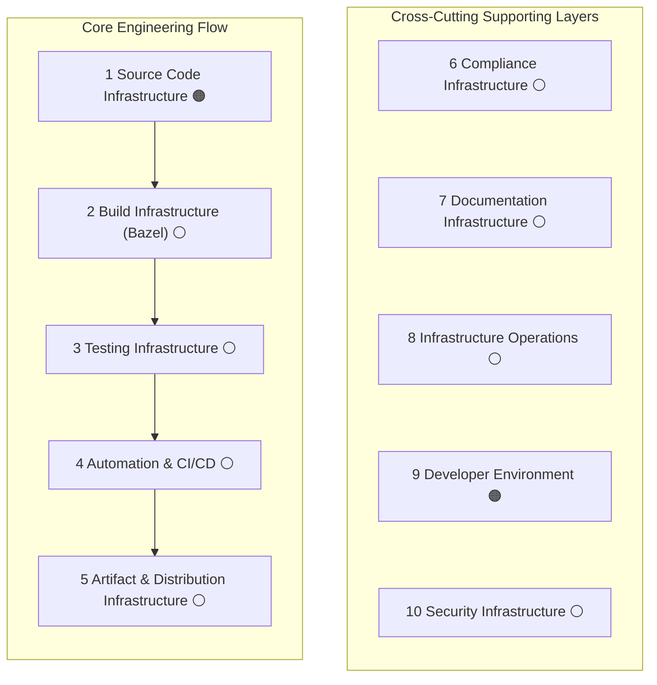

# S-CORE Infrastructure Landscape

:information_source: Work in progress. Some chapters are generated drafts and still under review.

---

## What This Is

A concise map of S-CORE engineering infrastructure: what exists, what is missing, and what needs priority.

## How To Read It

- Start with the chapter matching your topic.
- Use the status icon to judge maturity.
- Read "Biggest gap" to understand the next improvement focus.

## Chapter Map

## Status Legend

- 🟢 Implemented and effective
- 🟡 Partially implemented / needs improvement
- 🟠 Implemented but problematic or insufficient
- 🔴 Not started
- ⚪ Unknown / not yet assessed
