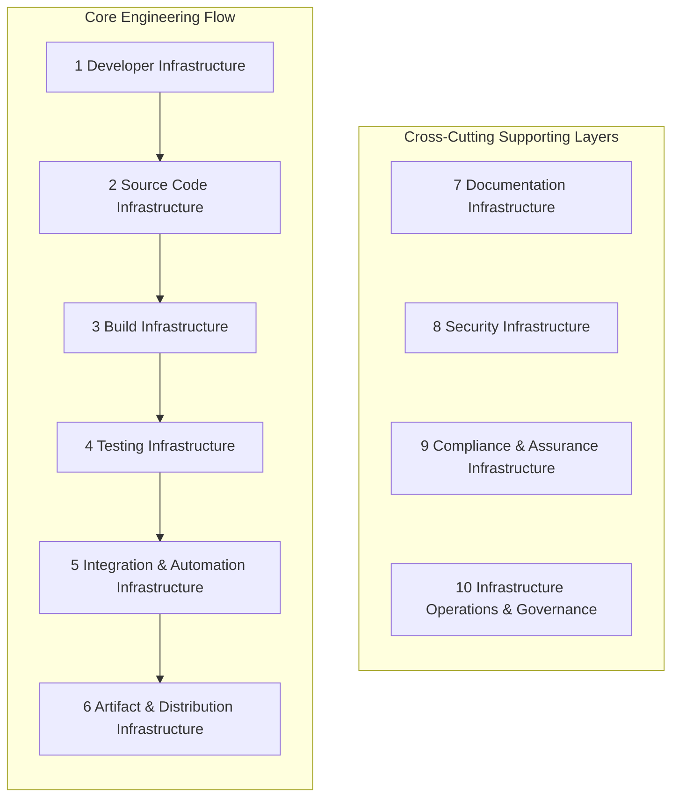

# S-CORE Infrastructure Landscape

:information_source: early work in progress - multiple chapters are generated (marked as such)

---

## Purpose

This document describes the infrastructure landscape required to develop, build, test, integrate, and distribute the S-CORE middleware.

Its goal is to provide a structured overview of the technical infrastructure that supports the project. This includes tooling, automation, policies, and operational processes used across the development lifecycle.

The document serves multiple purposes:

- **Transparency** – making infrastructure components and responsibilities visible to the community
- **Orientation** – helping contributors understand how the project is built and operated
- **Planning** – identifying infrastructure areas that exist, are evolving, or still need implementation

## Scope

The document focuses on **engineering infrastructure**, meaning systems and tooling used to support development and integration of the middleware.

This includes topics such as:

Each chapter describes the purpose of the infrastructure domain and lists the individual infrastructure capabilities required to support it. Using that infrastructure to achieve results is typically **out of scope**.

## Infrastructure Status

Legend:

- 🟢 Implemented and working well
- 🟡 Partially implemented or needs improvement
- 🟠 Implemented but problematic or insufficient
- 🔴 Not started
- ⚪ Unknown / not yet assessed

## Chapter Status

<!-- auto-generated chapter status table -->
| Chapter | Status |
| --- | --- |
| [1 Source Code Infrastructure](chapters/01-source-code-infrastructure.md) | 🟠 |
| [2 Build Infrastructure (Bazel)](chapters/02-build-infrastructure.md) | ⚪ |
| [3 Testing Infrastructure](chapters/03-testing-infrastructure.md) | ⚪ |
| [4 Automation Infrastructure & Continuous Integration (CI/CD)](chapters/04-automation-integration.md) | ⚪ |
| [5 Artifact & Distribution Infrastructure](chapters/05-artifact-distribution.md) | ⚪ |
| [6 Compliance Infrastructure](chapters/06-compliance-infrastructure.md) | ⚪ |
| [7 Documentation Infrastructure](chapters/07-documentation-infrastructure.md) | ⚪ |
| [8 Infrastructure Operations](chapters/08-infrastructure-operations.md) | ⚪ |
| [9 Developer Environment](chapters/09-developer-environment.md) | 🟠 |
| [10 Security Infrastructure](chapters/10-security-infrastructure.md) | ⚪ |
<!-- end of auto-generated chapter status table -->

## Why here? Why markdown?

This website offers very good usability for collaborative editing.
The final form is not known yet.
Maybe a website.
Maybe GitHub issues.
