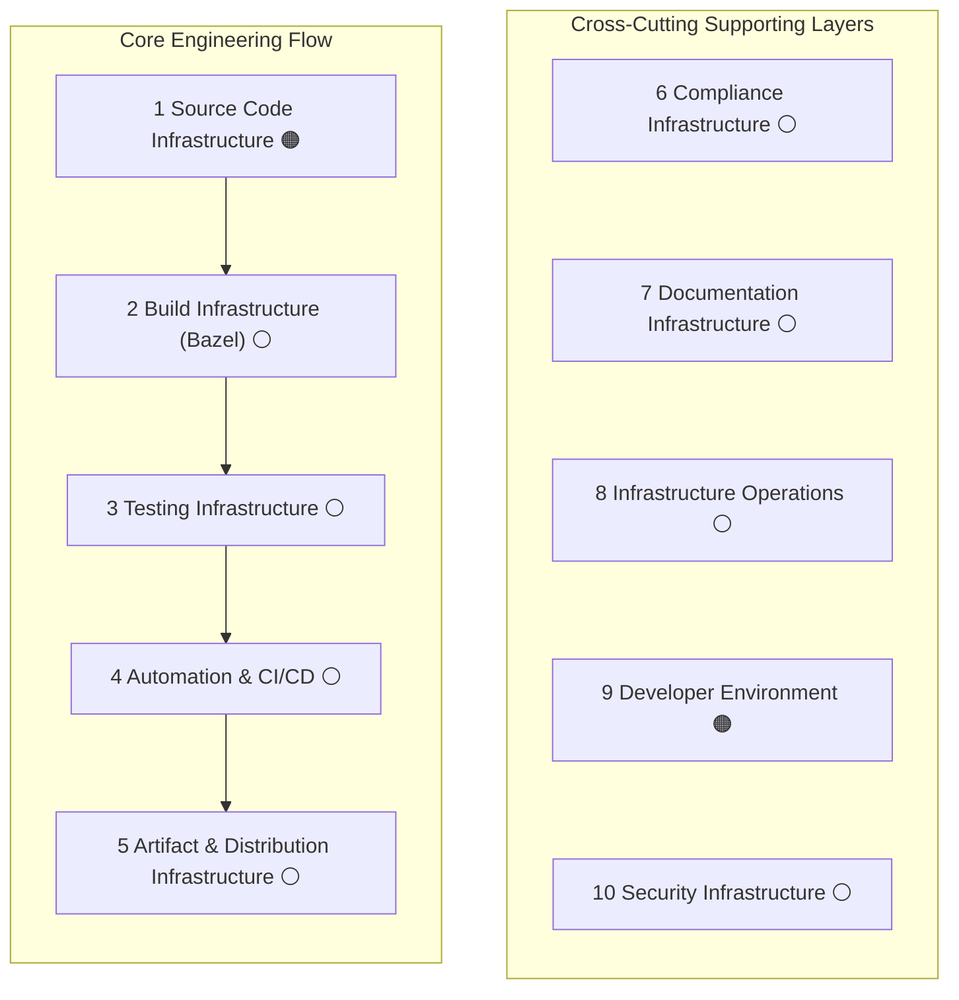

# S-CORE Infrastructure Landscape

:information_source: Early work in progress. Some chapters are currently generated drafts and will be refined iteratively.

---

## Purpose

This document maps the engineering infrastructure required to develop, build, test, integrate, secure, and distribute the S-CORE middleware.

It is intended as decision support, not only as an inventory. It helps teams answer:

- What infrastructure exists today?
- What is reliable, risky, or still missing?
- What should be prioritized next?

## Stakeholder Perspectives

### Project manager / product lead

Needs cross-domain visibility, ownership clarity, risk transparency, and prioritization input for roadmap planning.

### Infrastructure team member

Needs clear domain boundaries, required capabilities, operational expectations, and interfaces to adjacent domains.

### Project developer using infrastructure

Needs discoverable self-service workflows, clear entry points, and predictable tooling quality for daily development.

### Contributor / newcomer

Needs fast orientation, shared terminology, and simple navigation to chapter-level details.

## Scope

The document focuses on **engineering infrastructure**, meaning systems and tooling used to support development and integration of the middleware.

In scope:

- Engineering infrastructure systems and tooling
- Automation, policies, and operational practices across the development lifecycle
- Capability-level status and gaps per infrastructure domain

Out of scope:

- Feature-level product behavior
- General team process details that are not infrastructure-specific
- Full tool tutorials and runbooks (maintained in dedicated documents)

This includes domains such as:

Each chapter should describe:

- Domain purpose and boundaries
- Required capabilities
- Current state with evidence where available
- Known gaps, risks, and next improvements
- Ownership (team or role), if known

## How To Use This Landscape

- For planning and governance: use status and gaps to prioritize work and define roadmap items.
- For implementation: use capability lists as baseline contracts for infrastructure domains.
- For day-to-day development: use chapter links as entry points to tooling and process references.

## Infrastructure Status Model

Legend:

- 🟢 Implemented and effective in regular use
- 🟡 Partially implemented, inconsistent, or missing key quality attributes
- 🟠 Implemented but currently problematic or insufficient for project needs
- 🔴 Not started
- ⚪ Unknown / not yet assessed

Assessment guidance:

- Prefer evidence over opinion (pipeline usage, metrics, incidents, user feedback)
- State assumptions explicitly when evidence is not yet available
- Reassess statuses periodically to keep planning decisions current

## Documentation Approach

This landscape is maintained as Markdown in a docs-as-code workflow because it:

- Keeps review and change history transparent
- Supports collaborative editing through pull requests
- Can be published as a website while remaining repository-native

The final delivery form can evolve (website, issue views, or other formats), while this source remains the canonical baseline.
