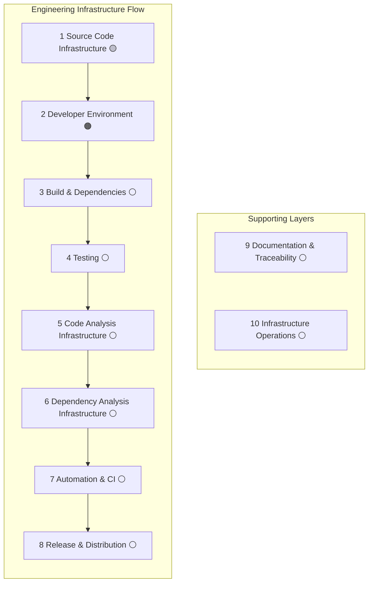

# S-CORE Infrastructure Landscape

  
Overview, roadmap, contribution guide, and reference

  <h2>Get oriented in the S-CORE infrastructure landscape.</h2>
  

    This site explains what S-CORE infrastructure is, which building blocks already exist, how mature they are,
    what is still missing, and how a concrete issue or pull request fits into the bigger picture.
  

  

    <h3>Who should read this</h3>
    

      Technical and non-technical stakeholders who need an overview, plus infrastructure contributors
      who need to understand the current state, gaps, and direction of the project infrastructure.
    

    
Typical reader questions:

    <ul>
      <li>What do we mean by S-CORE infrastructure?</li>
      <li>Which infrastructure building blocks already exist?</li>
      <li>How far along is each area?</li>
    </ul>
  

  

    <h3>What it covers</h3>
    

      The technical capabilities that make engineering work possible and scalable across S-CORE:
      source code infrastructure, developer environment, builds and dependencies, testing,
      code analysis, dependency analysis, automation, release distribution, documentation,
      traceability, and operations.
    

    

      Cross-cutting concerns such as security and compliance are described inside the chapters
      where the work actually happens rather than as standalone silos.
    

  

  

    <h3>What this site is for</h3>
    

      An infrastructure overview, a development map for current state and remaining work,
      a contribution map for infrastructure contributors, and a reference for architecture
      and cross-cutting concerns.
    

    
Typical contributor questions:

    <ul>
      <li>How do we do a specific thing?</li>
      <li>Where should I look for a topic or responsibility?</li>
      <li>How does this issue or PR belong to the big picture?</li>
    </ul>
  

## Start Here

  

    <h3>For a quick overview</h3>
    <ul>
      <li>Scan the chapter map below.</li>
      <li>Use the status icon to judge maturity at a glance.</li>
      <li>Open the chapter that matches the area you want to understand better.</li>
    </ul>
  

  

    <h3>For contribution work</h3>
    <ul>
      <li>Find the most relevant infrastructure chapter.</li>
      <li>Read the summary, maturity, and "Biggest gap".</li>
      <li>Use that context to place an issue, PR, or initiative in the wider infrastructure picture.</li>
    </ul>
  

## Chapter Map

## How To Use A Chapter

  

    <h3>1. Pick a topic</h3>
    
Open the area closest to your question, task, or architectural concern.

  

  

    <h3>2. Check maturity</h3>
    
Use the status icon to understand whether the area is established, partial, weak, or still unclear.

  

  

    <h3>3. Look at the gap</h3>
    
Read "Biggest gap" to see what is missing, what remains to be improved, and why the area still matters.

  

## Status Legend

- 🟢 Implemented and effective
- 🟡 Partially implemented / needs improvement
- 🟠 Implemented but problematic or insufficient
- 🔴 Not started
- ⚪ Unknown / not yet assessed
