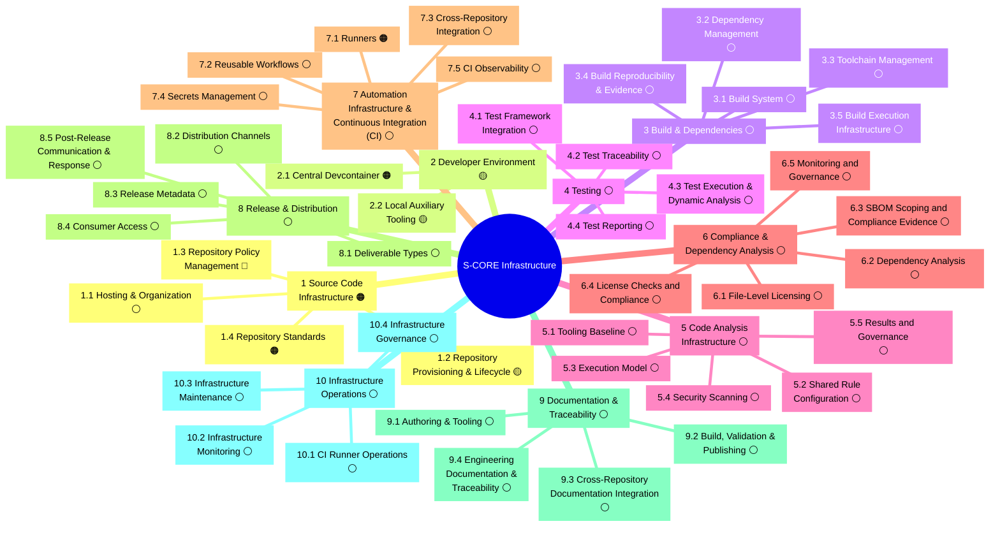

# S-CORE Infrastructure

  
Developer guide and infrastructure reference for the S-CORE ecosystem

  <h2>Build, test, and ship with S-CORE infrastructure.</h2>
  

    Practical guides for day-to-day development — setting up your environment, building with Bazel,
    running tests, enforcing code quality, and publishing modules. Plus the full infrastructure landscape
    assessment for context on how the pieces fit together.
  

## Quick Links

  
Developer Guides

  

    <a class="landing-card-link" href="guide/quick-reference/">
      
Quick Reference

      
All key repositories, commands, and links on one page.

    </a>
    <a class="landing-card-link" href="guide/getting-started/">
      
Getting Started

      
Step-by-step setup for new contributors.

    </a>
    <a class="landing-card-link" href="guide/building/">
      
Building with Bazel

      
Registry, dependencies, toolchains, and lock files.

    </a>
    <a class="landing-card-link" href="guide/testing/">
      
Testing

      
Test frameworks, coverage, and sanitizers.

    </a>
    <a class="landing-card-link" href="guide/code-quality/">
      
Code Quality

      
Pre-commit hooks, policies, and license headers.

    </a>
    <a class="landing-card-link" href="guide/publishing/">
      
Publishing Modules

      
Release, registry, and versioning workflow.

    </a>
    <a class="landing-card-link" href="guide/writing-docs/">
      
Writing Documentation

      
MkDocs toolchain, preview, and style guide.

    </a>
  

  
Infrastructure Team

  

    <a class="landing-card-link" href="https://github.com/orgs/eclipse-score/discussions/236" target="_blank" rel="noopener">
      
Meeting Minutes

      
Infrastructure team meeting notes on GitHub Discussions.

    </a>
    <a class="landing-card-link" href="https://sdvworkinggroup.slack.com/archives/C0894QGRZDM" target="_blank" rel="noopener">
      
Slack: #score-infrastructure

      
Main channel for infrastructure team discussion.

    </a>
    <a class="landing-card-link" href="https://sdvworkinggroup.slack.com/archives/C08RDRKH5FE" target="_blank" rel="noopener">
      
Slack: #score-infrastructure-review-requests

      
Drop PR links here for review — no comments, just links.

    </a>
    <a class="landing-card-link" href="https://eclipse-score.github.io/.github/" target="_blank" rel="noopener">
      
Repository Overview

      
Cross-repo metrics and status across all eclipse-score repositories.

    </a>
  

  
S-CORE Project

  

    <a class="landing-card-link" href="https://eclipse.dev/score/" target="_blank" rel="noopener">
      
S-CORE Website

      
The main Eclipse S-CORE project website — "Open by Choice. Safe by Design."

    </a>
    <a class="landing-card-link" href="https://eclipse-score.github.io/score/main/handbook" target="_blank" rel="noopener">
      
S-CORE Handbook

      
Technical handbook — processes, tooling, and contribution model.

    </a>
  

## Chapter Map

<!-- BEGIN GENERATED CHAPTER MAP -->

This chapter map is generated from the `#` and `##` headings in the numbered chapter files. Click any chapter or section box to open it.

<!-- END GENERATED CHAPTER MAP -->

## Status Legend

- 🟢 Implemented and effective
- 🟡 Partially implemented / needs improvement
- 🟠 Implemented but problematic or insufficient
- 🔴 Not started
- ⚪ Unknown / not yet assessed
